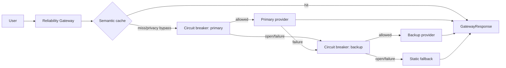

# Báo cáo Day 25 — Reliability Engineering for Production Agents

**Sinh viên:** Phạm Khắc Duy - 2A202601757
**Ngày:** 27/08/2026

## 1. Tóm tắt kiến trúc



Gateway kiểm tra cache trước, bảo vệ từng provider bằng circuit breaker ba trạng thái, chuyển sang backup khi primary lỗi/mở mạch và cuối cùng trả thông báo degraded tĩnh.

## 2. Cấu hình

| Thiết lập           |      Giá trị | Lý do                                                                   |
| --------------------- | -------------: | ------------------------------------------------------------------------ |
| failure_threshold     |              3 | Mở mạch sau một cụm lỗi ngắn, hạn chế retry storm.               |
| reset_timeout_seconds |            2.0 | Cho provider phục hồi trước probe HALF_OPEN.                         |
| success_threshold     |              1 | Một probe thành công đủ đóng mạch trong lab tuần tự.           |
| cache backend         |         memory | Memory là baseline; Redis được kiểm chứng riêng cho shared state. |
| cache TTL             |      300 giây | Giới hạn độ cũ của phản hồi.                                     |
| similarity_threshold  |           0.92 | Ngưỡng cao để giảm semantic false hit.                              |
| load_test requests    |   100/scenario | Đủ tạo cache hit và nhiều lần chuyển trạng thái.                |
| random seed           | 42 (A/B: 4242) | Lặp lại lựa chọn query/failure cho so sánh công bằng.             |

## 3. SLO và kết quả

SLO được đối chiếu với scenario phù hợp, không dùng aggregate có chủ đích chứa `all_providers_down`.

| SLI                                        |       SLO | Kết quả thực đo | Đạt? |
| ------------------------------------------ | --------: | ------------------: | ------ |
| Availability (`all_healthy`)             |    >= 99% |             100.00% | Có    |
| P95 (`all_healthy`, provider path)       | < 2500 ms |           234.11 ms | Có    |
| Fallback success (`primary_timeout_100`) |    >= 95% |              92.86% | Không |
| Cache hit (`all_healthy`)                |    >= 10% |              67.00% | Có    |
| Recovery (`primary_flaky_50`)            | < 5000 ms |          2474.79 ms | Có    |

## 4. Metrics tổng hợp

Aggregate gồm 400 request qua bốn scenario, trong đó 100 request của `all_providers_down` được kỳ vọng thất bại an toàn.

| Metric                | Giá trị |
| --------------------- | --------: |
| availability          |    73.75% |
| error_rate            |    26.25% |
| latency_p50_ms        |    276.71 |
| latency_p95_ms        |     319.1 |
| latency_p99_ms        |     319.3 |
| fallback_success_rate |    41.01% |
| cache_hit_rate        |    46.00% |
| estimated_cost        |  0.048312 |
| estimated_cost_saved  |  0.184000 |
| circuit_open_count    |        12 |
| recovery_time_ms      |   2474.79 |

## 5. So sánh cache

Hai lượt chạy dùng provider khỏe và cùng seed 4242. Theo đặc tả lab, latency chỉ ghi cho provider path (`latency_ms > 0`), nên percentile không gồm cache-hit 0 ms.

| Metric         | Không cache | Có cache |   Delta |
| -------------- | -----------: | --------: | ------: |
| latency_p50_ms |       211.61 |     214.3 | +2.6900 |
| latency_p95_ms |       238.16 |    237.18 | -0.9800 |
| estimated_cost |     0.059800 |  0.023260 | -0.0365 |
| cache_hit_rate |        0.00% |    60.00% | +60.00% |

Cache giảm chi phí mô phỏng; khác biệt percentile provider path nhỏ và không đại diện latency end-to-end của cache hit.

## 6. Redis shared cache

Cache trong RAM bị chia cắt theo process và mất khi restart. `SharedRedisCache` dùng hash key ổn định, Redis Hash và EXPIRE, nên hai gateway instance có cùng prefix nhìn thấy cùng phản hồi; privacy guard và kiểm tra sai năm vẫn được áp dụng.

Bằng chứng chạy ngày 2026-08-27:

```text
docker compose ps: redis Up (healthy), 0.0.0.0:6379->6379/tcp
docker compose exec -T redis redis-cli ping: PONG
full pytest with Redis: 35 passed, 7 xpassed in 4.21s
shared-state test: tests/test_redis_cache.py::test_shared_state_across_instances PASSED
instance_two_get: ('visible from instance two', 1.0)
KEYS rl:cache:report:*: rl:cache:report:f9b2bf7b0364
HGETALL: query=shared cache evidence; response=visible from instance two
TTL ngay sau khi ghi: 299 giây (cấu hình 300 giây)
```

## 7. Chaos scenarios

| Scenario            | Kỳ vọng                               | Quan sát                                                  | Kết luận |
| ------------------- | --------------------------------------- | ---------------------------------------------------------- | ---------- |
| primary_timeout_100 | Primary mở mạch, backup tiếp quản   | availability 97.00%; fallback 92.86%; 6 lần mở mạch     | PASS       |
| primary_flaky_50    | Trộn primary/fallback và có recovery | availability 98.00%; recovery 2474.79 ms; 4 lần mở mạch | PASS       |
| all_healthy         | 100% thành công, không mở mạch     | availability 100.00%; 0 lần mở mạch                     | PASS       |
| all_providers_down  | Static fallback cho mọi request        | error rate 100.00%; 2 lần mở mạch                       | PASS       |

## 8. Phân tích điểm yếu còn lại

Circuit breaker hiện là state cục bộ từng gateway instance. Redis chỉ chia sẻ cache, nên nhiều replica có thể cùng gọi probe hoặc cùng tạo retry burst. Trước production cần đưa circuit state/counter vào kho dùng chung với thao tác atomic, thêm lease cho đúng một HALF_OPEN probe, và đo latency end-to-end gồm cả cache hit/static fallback.

Scenario primary lỗi hoàn toàn chỉ đạt fallback success dưới SLO 95% vì backup mặc định vẫn có fail rate 5% và có thể mở mạch. Cần thêm provider thứ ba hoặc tăng độ tin cậy backup.

## 9. Bước tiếp theo

1. Chia sẻ circuit state bằng Redis và bảo vệ HALF_OPEN probe bằng distributed lease.
2. Thêm rate limit/budget routing và metric latency end-to-end cho mọi route.
3. Thêm property-based/concurrency tests cho state transition và cache stampede.

## 10. Bằng chứng tái lập

```bash
pip install -e ".[dev]"
docker compose up -d
pytest -q
ruff check src tests scripts
mypy src scripts
python scripts/run_chaos.py
python scripts/generate_report.py
```

Kết quả đã xác minh: tests, lint, typecheck, chaos JSON và CSV đều hoàn tất. Các con số là simulation bằng `FakeLLMProvider`, không phải SLO của API LLM thật.
